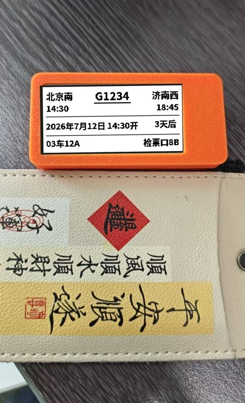
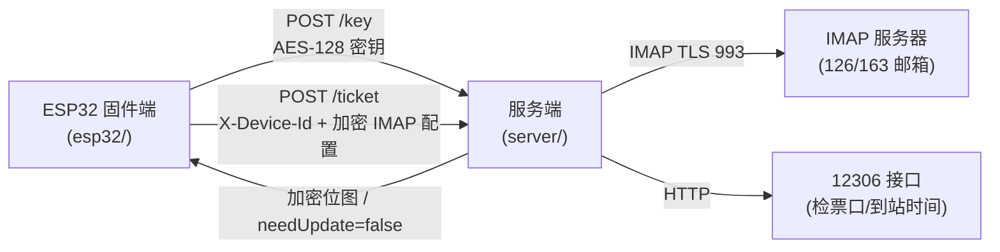

# 墨水屏高铁票挂件

一个基于 ESP32 + 墨水屏的迷你高铁票挂件：设备定时从 12306 购票邮件抓取车票信息，服务端渲染 1bit 位图加密下发，设备刷墨水屏后进入 deep sleep，超长续航。



## 特性

- **邮件抓票**：直连 IMAP（126/163 等邮箱）拉取 12306 购票通知邮件，自动解析车次、日期、座位、检票口等信息
- **业务筛选**：正确处理退票 / 改签 / 候补兑现场景，倒序遍历选出"最近待出行"的一张车票
- **服务端渲染**：中文字体与位图渲染全部在 Node.js 服务端完成，固件端零字体依赖
- **加密通信**：AES-128-CBC 加密 + base64(IV+密文) 传输，PKCS#7 填充
- **位图签名去重**：SHA-256 前 16 字符签名比对，内容未变时不下发位图，节省流量与刷屏次数
- **BLE 配网**：上电 15 秒 BLE 等待窗口，浏览器通过 Web Bluetooth 写入 WiFi / IMAP 配置到 NVS
- **超低功耗**：ESP32 deep sleep ~5mA，CR2477 理论续航数年
- **失败退避**：30s → 90s → 270s 退避重试，连续失败后屏显告警并按正常周期唤醒
- **多板型适配**：支持 esp32dev / esp32s3 / seeed_xiao_esp32s3 / seeed_xiao_esp32s3_3C 多种环境
- **静态挂件模式**：未配置抓票信息时，可仅上传一张 1bit 挂件图，设备显示后永久 deep sleep，当作可自定义图片的静态挂件

## 目录结构

```
软件/
├── esp32/                       # ESP32 固件端（PlatformIO / Arduino）
│   ├── platformio.ini           # 多环境构建配置
│   ├── src/
│   │   ├── main.cpp             # 主入口
│   │   ├── config.h             # 全局配置与引脚定义
│   │   ├── config_manager.*     # NVS 配置读写 + BLE 配网
│   │   ├── ble_cfg.*            # NimBLE BLE 配网服务
│   │   ├── wifi_mgr.*           # WiFi 连接 + NTP 同步
│   │   ├── epaper_render.*      # 墨水屏渲染（接收位图刷屏）
│   │   ├── rtc_sleep.*          # RTC 定时 deep sleep
│   │   └── utils.*              # AES 加解密 + base64
│   └── README.md                # 固件端详细说明
├── server/                      # Node.js 服务端
│   ├── package.json
│   ├── .env.example             # 环境变量示例
│   ├── src/
│   │   ├── index.js             # Fastify HTTP 服务 + IMAP 抓取主流程
│   │   ├── config.js            # datas.json 读写（AES key / 签名 / 游标）
│   │   ├── imap-fetcher.js      # ImapFlow 抓取 + UID 增量游标
│   │   ├── parser.js            # 12306 邮件正文解析
│   │   ├── ticket-finder.js     # 车票筛选（退票 / 改签 / 候补）
│   │   ├── render-bitmap.js     # 车票对象 → 墨水屏位图 Buffer
│   │   ├── check-position-fetcher.js  # 检票口查询（12306 接口）
│   │   ├── arrive-time-fetcher.js     # 到达时间查询（12306 接口）
│   │   └── utils.js             # AES-128-CBC 加解密 + CRC16
│   └── README.md                # 服务端详细说明
├── docs/
│   ├── 硬件接线.md              # 物料清单与接线说明
│   ├── cfg.html                 # BLE 配网页面（Web Bluetooth）
│   └── code-review-2026-08-03.md
├── design/                      # 车票版式设计稿（多分辨率）
├── images/                      # README 与文档配图
└── README.md
```

## 整体架构



## 工作流程

```
[上电] → 初始化墨水屏 → 连接 WiFi → 同步 NTP
       → POST /ticket（加密 IMAP 配置）
       → 服务端：IMAP 抓取 12306 邮件 → 筛选最近车票 → 渲染位图 → 加密下发
       → 固件端：解密位图 → 刷墨水屏 → 关闭 WiFi
       → deep sleep 等待下次唤醒
```

## 快速开始

### 1. 服务端

```bash
cd server
npm install
cp .env.example .env   # 按需修改
npm start              # 默认监听 8080
```

### 2. 固件端

使用 [PlatformIO](https://platformio.io/) 编译烧录：

```bash
cd esp32
pio run -e esp32dev          # 编译
pio run -e esp32dev -t upload # 烧录
pio device monitor           # 串口监视器
```

### 3. BLE 配网

烧录后上电，设备启动 15 秒 BLE 等待窗口。用手机 / 电脑浏览器打开 [docs/cfg.html](docs/cfg.html)（需支持 Web Bluetooth），连接设备后写入：

- WiFi SSID / 密码
- IMAP 用户名 / 授权码 / 服务器 / 端口
- 唤醒时间

配置写入 NVS 后生效，下次唤醒自动连接。

#### 静态挂件模式（可选）

若只想把设备当作静态图片挂件使用（不抓取车票），可仅上传挂件图、不配置 IMAP/WiFi：

1. BLE 连接后上传一张 250×122（或 212×104）1bit 位图（浏览器端自动缩放 + Atkinson 抖动）
2. 不配置 IMAP / WiFi / 唤醒时间
3. BLE 窗口超时后，设备检测到缺配置 → 显示挂件图 → 永久 deep sleep（不设唤醒源，仅 RST/重新上电可唤醒）

挂件图也存于 NVS，正常抓票流程无票 fallback 时同样会显示。换图按 RST 重启重新上传即可。

## 技术栈

| 端 | 技术 |
|---|---|
| 固件端 | ESP32 Arduino (C/C++)、GxEPD2、NimBLE、mbedtls AES-128-CBC |
| 服务端 | Node.js、Fastify、imapflow、@napi-rs/canvas |
| 构建 | PlatformIO（esp32dev / esp32s3 / seeed_xiao_esp32s3 / seeed_xiao_esp32s3_3C） |
| 通信 | AES-128-CBC、base64(IV+密文)、PKCS#7 |

## 文档

- [固件端说明](esp32/README.md)
- [服务端说明](server/README.md)
- [硬件接线](docs/硬件接线.md)
- [BLE 配网页面](docs/cfg.html)

## 致谢

- [12306](https://www.12306.cn/) 邮件通知服务
- [GxEPD2](https://github.com/ZinggJM/GxEPD2) 墨水屏驱动
- [NimBLE-Arduino](https://github.com/h2zero/NimBLE-Arduino) BLE 协议栈
- [ImapFlow](https://imapflow.com/) IMAP 客户端

## License

MIT
