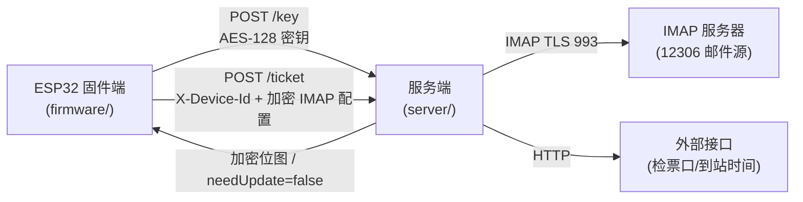
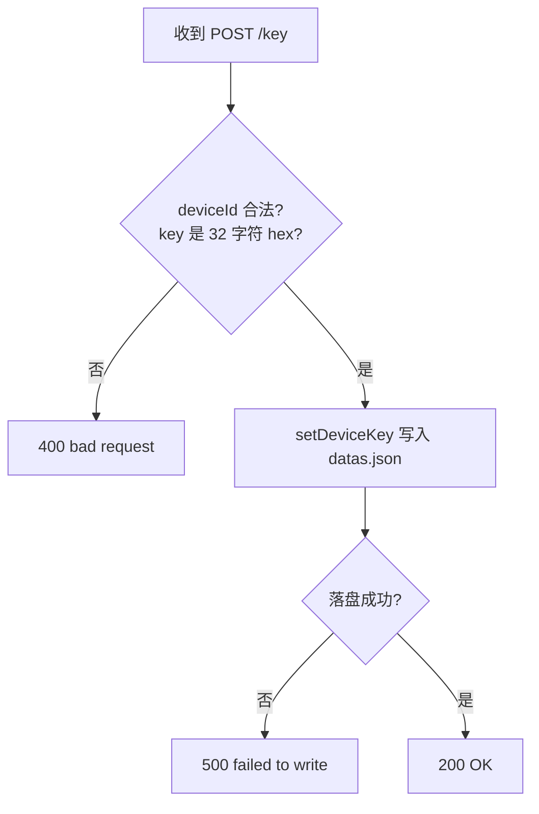
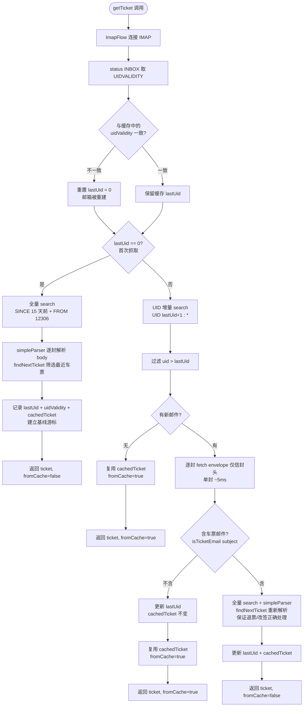

# 墨水屏高铁票挂件 - 服务端

接收 ESP32 固件端的密钥推送和抓票请求，连 IMAP 拉取 12306 邮件、渲染位图、加密下发。

## 目录结构

```
server/
├── src/
│   ├── index.js              # Fastify HTTP 服务 + IMAP 抓取主流程
│   ├── config.js             # datas.json 读写（AES key / 位图签名 / IMAP 游标）
│   ├── parser.js             # 12306 邮件正文解析（订单号/车次/日期/座位等）
│   ├── ticket-finder.js      # 从邮件数组中筛选"最近待出行"车票（处理退票/改签）
│   ├── render-bitmap.js      # 车票对象 → 墨水屏位图 Buffer
│   ├── check-position-fetcher.js  # 检票口查询（外部接口）
│   ├── arrive-time-fetcher.js     # 到达时间查询（外部接口）
│   ├── utils.js              # AES-128-CBC 加解密 + CRC16
│   ├── test-render.js        # 渲染调试脚本
│   └── test-finder.js        # 解析调试脚本
├── datas.json                # 运行时动态数据（运行后生成）
└── README.md
```

## 启动

```bash
cd server
npm install
npm start              # 默认监听 8080
# PORT=9000 npm start  # 自定义端口
```

## 关键配置（.env）

| 项 | 默认值 | 说明 |
|---|---|---|
| `PORT` | `8080` | HTTP 监听端口 |
| `MOCK_TICKET` | `false` | 跳过 IMAP 抓取，用空车票模板渲染（调试用） |
| `SAVE_PREVIEW` | `false` | 渲染时同步保存 PNG 预览到 `tmp-previews/`（调试用） |
| `TICKET_SENDERS` | `12306@rails.com.cn` | 全量抓取时的发件人过滤 |

## HTTP 接口

| 方法 | 路径 | 作用 |
|---|---|---|
| GET | `/` | 健康检查 |
| POST | `/key` | 固件端推送 `deviceId → AES-128 hex 密钥`，写入 `datas.json` |
| POST | `/ticket` | 固件端推送加密后的 IMAP 配置，服务端抓票、渲染、签名比对、加密下发位图 |

---

## 整体架构



---

## POST /key 流程



---

## POST /ticket 主流程

```mermaid
flowchart TD
    A[收到 POST /ticket] --> B{X-Device-Id 存在?<br/>body.enstr 非空?}
    B -- 否 --> X1[400 bad request]
    B -- 是 --> C[查 datas.json 取该 deviceId 的 AES hex key]
    C --> D{key 存在?}
    D -- 否 --> X2[401 device not registered<br/>固件端会清 kp 标志重推]
    D -- 是 --> E[AES-128-CBC 解密 enstr<br/>拆分 user|pass|host|port|useSecure]
    E --> F{解密成功?}
    F -- 否 --> X3[400 decrypt failed]
    F -- 是 --> G[getTicket 抓票<br/>返回 ticket + fromCache 标志]

    G --> H{fromCache 且<br/>cachedTicketDate == 今天?}
    H -- 是 --> FAST[同日重复请求快速路径<br/>跳过渲染/签名<br/>直接返回 needUpdate=false]
    H -- 否 --> I[renderTicket 渲染位图]

    I --> J[若 fromCache: 更新 cachedTicketDate = 今天]
    J --> K[computeBitmapSign SHA256 前 16 字符]
    K --> L[与 datas.json 中上次签名比对]
    L --> M{sign 变了?}

    M -- 是,有票 --> N1[加密位图<br/>返回 needUpdate=true + bitmap]
    M -- 是,无票 --> N2[不下发位图<br/>返回 needUpdate=true + hasTicket=false<br/>固件端走 fallback 画面]
    M -- 否 --> N3[返回 needUpdate=false<br/>固件端保留画面]
```

---

## IMAP 抓取决策树（v6 优化重点）

`getTicket(imapCfg, deviceId)` 的完整决策路径。优化目标是：**日常无新邮件时跳过邮件正文抓取和解析**，把服务端响应时间从 ~3-5s 降到 ~0.5s。



### 为什么"含车票邮件"时仍要全量重抓

`findNextTicket` 需要完整的邮件列表来正确处理：
- 退票邮件 → 把订单号加入 `refundOrderNos`，跳过对应购票
- 改签邮件 → 把订单号加入 `changeOrderNos`，跳过原购票

只看增量邮件会漏掉历史退票/改签邮件，导致最近车票算错。所以增量阶段只用来**快速判断是否需要重抓**，真正的解析仍走全量。

### 倒计时与"同日重复请求快速路径"

位图内容 = 车票信息 + `daysLeft`（基于 `nowIso` 实时计算）。即使无新邮件，**跨日时 `daysLeft` 会变化**，位图签名必然变化。

| 场景 | 行为 | 响应时间 |
|---|---|---|
| 首次抓取（无游标） | 全量 + 建立基线 | ~3-5s（一次性） |
| UIDVALIDITY 变化 | 重置游标走全量 | ~3-5s（极少触发） |
| 无新邮件 | 复用 cachedTicket | ~0.5s |
| 新邮件均非车票 | 仅 fetch envelope，复用 cachedTicket | ~0.6s |
| 新邮件含车票邮件 | 全量重抓 + 重新解析 | ~3-5s |
| 同日重复请求（含失败重试） | cachedTicketDate 命中 → 跳过渲染，直接 needUpdate=false | ~50ms |
| 跨日请求 | fromCache=true 但日期不同 → 正常渲染（daysLeft 变了） | ~0.6s |

---

## datas.json 数据结构

```json
{
  "aesKeys": {
    "device-001": "a1b2c3d4e5f6a7b8c9d0e1f2a3b4c5d6"
  },
  "bitmapSigns": {
    "device-001": "9f8a7b6c5d4e3f2a"
  },
  "imapCursors": {
    "device-001": {
      "lastUid": 12345,
      "uidValidity": 1700000000,
      "cachedTicket": { "orderNo": "EE1005", "trainNo": "G1234", "date": "2026-08-01", "..." : "..." },
      "cachedTicketDate": "2026-07-23"
    }
  }
}
```

| 字段 | 作用 |
|---|---|
| `aesKeys` | deviceId → 32 字符 hex AES-128 密钥（固件端 POST /key 推送） |
| `bitmapSigns` | deviceId → 16 字符 hex 位图签名（用于 needUpdate 判断） |
| `imapCursors.lastUid` | 已抓取到的最大 UID（增量抓取游标） |
| `imapCursors.uidValidity` | 上次记录的 UIDVALIDITY（检测邮箱是否重建） |
| `imapCursors.cachedTicket` | 上次解析出的车票对象（无新邮件时复用） |
| `imapCursors.cachedTicketDate` | 上次渲染日期 YYYY-MM-DD（同日重复请求快速路径） |

---

## 加解密协议

固件端与服务端使用同一 16 字节 AES-128-CBC 密钥（32 字符 hex），同一 PKCS#7 填充，同一传输格式 `base64( IV(16字节) + 密文 )`。

| 方向 | 明文格式 | 用途 |
|---|---|---|
| 固件端 → 服务端 | `user|pass|host|port|useSecure` | IMAP 配置加密上传 |
| 服务端 → 固件端 | 原始位图 Buffer | 加密下发位图 |

配对实现在 [server/src/utils.js](src/utils.js) 和 [firmware/src/utils.cpp](../firmware/src/utils.cpp)。

---

## 限制

- 服务端无鉴权，部署时需放在内网或加反代鉴权
- 163 邮箱 IMAP 不支持 `FROM`/`BODY` 字符串搜索，全量路径回退为 `SINCE` 过滤 + 客户端逐封比对
- 固件端 Flash 紧张（95%），服务端单次响应需控制在 8s 内（固件端 HTTP 超时已设为 8s）
